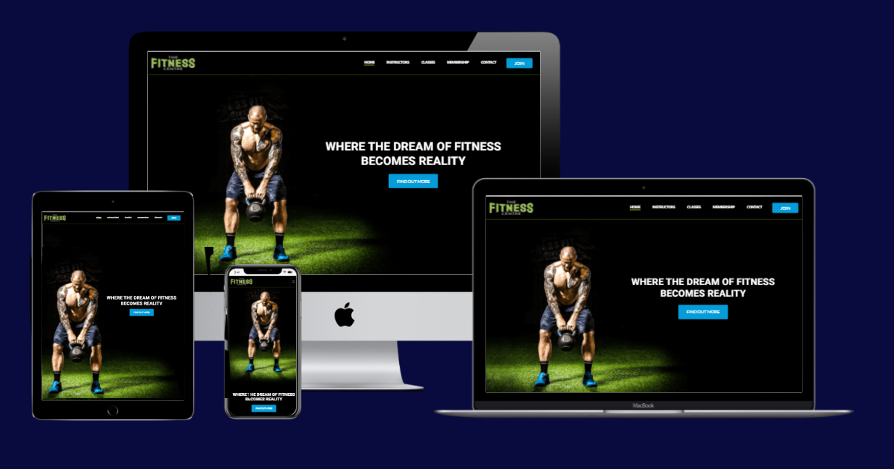
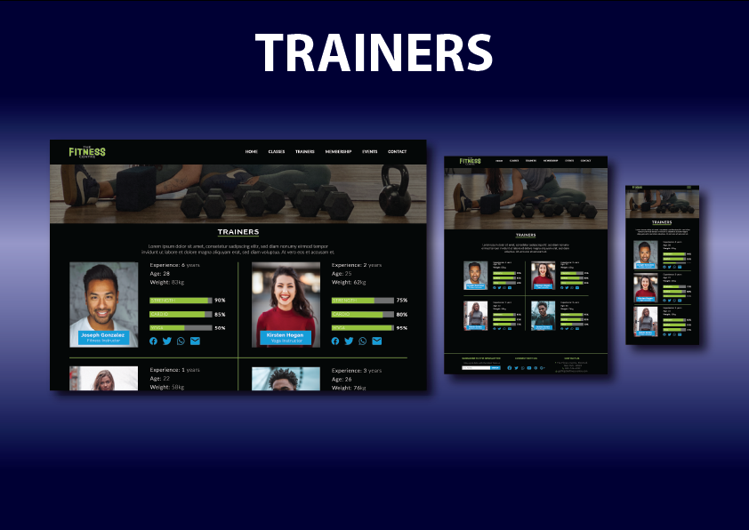
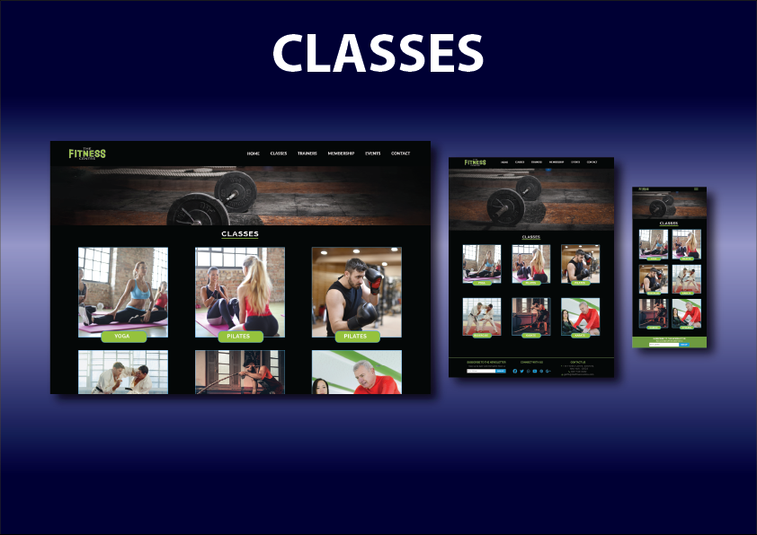
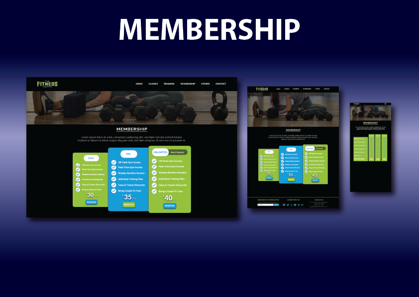
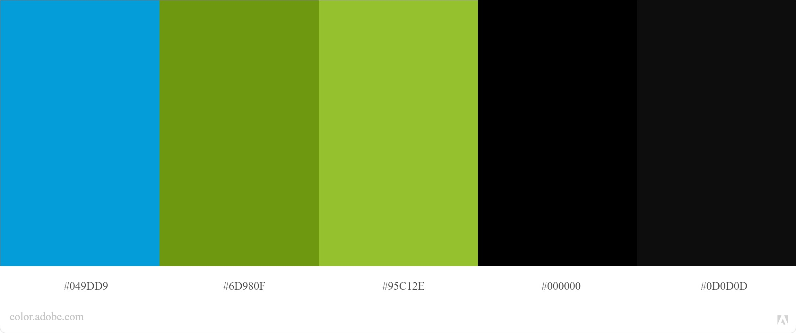
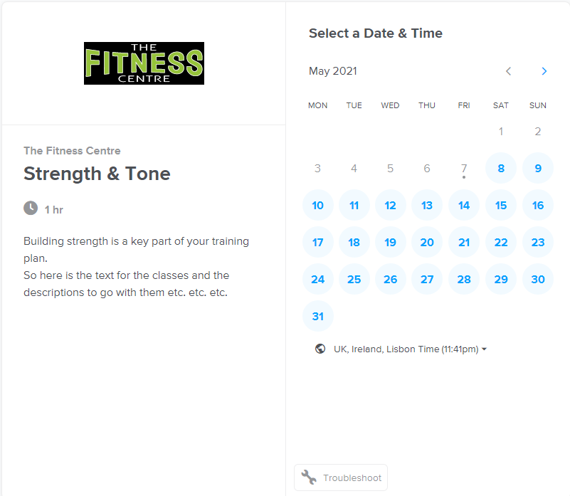
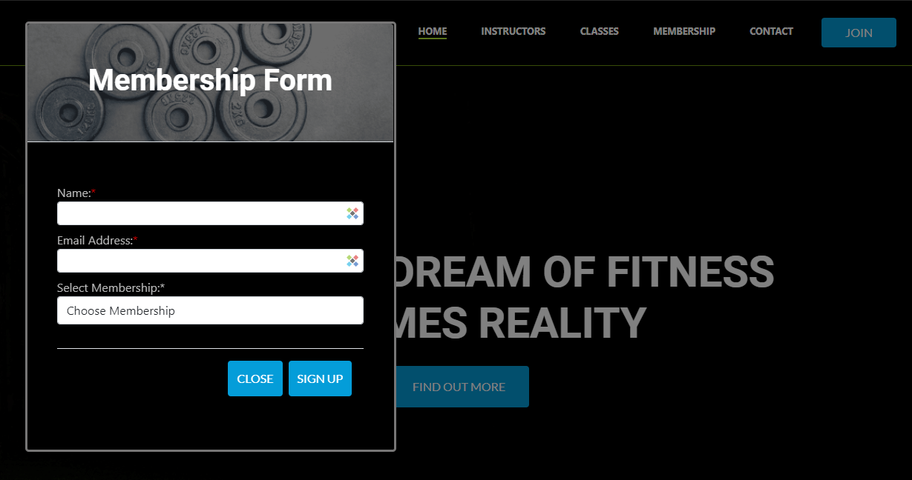
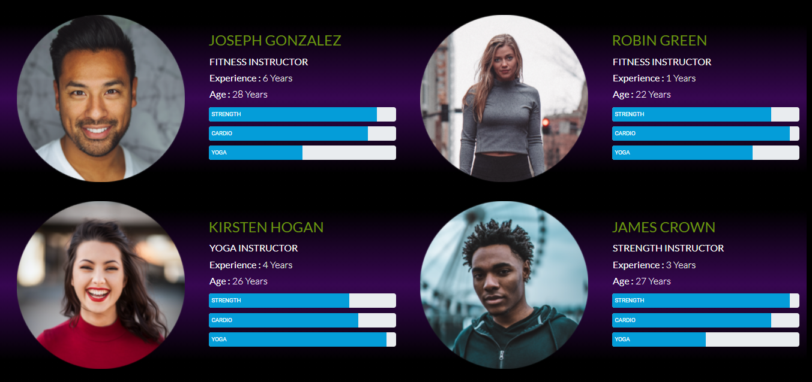

----

This is the README file for my Code Institute MS1 project site, The Fitness Centre.

[View the live site here](https://tomossmith.github.io/MS1-TheFitnessCentre/)

----

A responsive website designed to promote energy, fun and excellent facilities with the goal of attracting new members and to retain existing members.

----
# User Experience (UX)

* ### First Time Visitor Goals
    
     * First Time Visitors, should be able to understand the purpose and reason for the site.
     * First Time Visitors, should be able to easily find the navigation links.       
     * First Time Visitors, should be able to see key information such as how to join and what the gym offers.
     * First Time Visitors, should be able to see what other members say about their experience at the gym.
        

* ### Returning Visitor Goals

     * Returning Visitors, should be able to see what membership packages are available.
     * Returning Visitors, should be able to sign up to a membership package.
     * Returning Visitors, should have an easy way to contact a member of staff to discuss any membership queries.
     * Returning Visitors, should be able to find the opening hours and contact information.
     * Returning Visitors, should be able to find social links to be able to engage within the online community.
     * Returning Visitors, should be able to find more information about the trainers.
     * Returning Visitors, should be able to find what classes are available, when they are available and also book one.

----

* ## Design

* ### Structure & Mockup Designs

    After searching the internet for similar sites, I started gathering ideas on elements that I felt that worked well for a gym website and also element that I would like to create on this site.
    I used Adobe XD to generate my mockup design as I felt that it would help to display how the colours and elements work together. I also felt by generating a more detailed mockup that includes some
    of the text data and images, it would help speed my coding process up and prevent having to stop each time to find images etc. I felt this was a great help as it meant I could keep focused on the coding instead of the content.

    I designed mockups for web,tablet and mobile in order to see how I can expect the layout to change when being displayed on different platforms.
    

    

    

    
Mockup Layout for the Trainer page.

     
    

    

    

    
Mockup Layout for the Classes page.

     
    

    

    

    
Mockup Layout for the Membership page.

     
    

    

    

    
Mockup Layout for the Contact page.

     
    

    

* ### Colour scheme   
    

    
In order to make sure I chose a compatible and effective selection of colours, I chose to use Adobe Color to help me with my design.

     
    

    

* ### Typography 
    I think the font plays a big part in the first impressions of the website and i was looking for something that was quite minimal and modern.
    After looking through the google font library i chose the following:

    The main font is Lato [Link](https://fonts.google.com/specimen/Raleway?query=Lato)
    
    The secondary font is Roboto [Link](https://fonts.google.com/specimen/Lato?query=Roboto)

* ### What I changed from my mockup designs

    Although I was quite happy with my mockup design and felt happy with the color scheme and choice of images, there were sections of the page that didn't flow as well as I had hoped once I had designed them.

    Once designed, I ran through the site with my mentor and some of the changes we decided to make were;

    - Instead of having a large selection of pages, we thought it would work well to have the majority of the gym's facilities and information on the homepage. I thought this because its the first page that the user sees, and its important to grab their attention as much as possible and minimise any waiting/loading times. Therefore by having all the information on one page, it meant that all the key information that the user needs was instantaneously available to them.

    Once I have the user's attention, it meant that any further information that I felt the user would want to know could be branched out onto other pages.

    - I liked the idea of having a simple table/diagram to show the user what memberships were available, however when trying to keep the design responsive and compatible on mobile devices, it felt difficult to try to fit all the detail into a small screen. I therefore chose to re-design the layout into a design that could be stacked vertically on smaller screens. This worked well I feel and was much easier to keep the design responsive for smaller devices.

    - Although I had reduced the number of pages by including more information on the homepage, I felt that having a full page for a contact form was poor use of space and an un-necessary page movement for the user. I therefore chose to use a modal to display the form. By using a modal I think it feels a lot more professional and the website retains the user's attention by keeping the focus on the key pages without re-directing the user to different areas.
    It also felt like the form could be presented to the user quickly, and also helps the user return to the original page quickly once completed as the original page is still loaded in the background.

----

* ## Media

* ### Images

    I sourced the images for the website from [Unsplash](https://unsplash.com/) [Vecteezy](https://www.vecteezy.com/) [Pexels]{https://www.pexels.com/}
    [Adobe Stock](https://stock.adobe.com/). I chose to out-source the imaging to ensure the highest quality of images and also to make sure that I
    had a large selection of images to choose from.

    * #### Logo
        The logo for the page was designed myself using Adobe Illustrator. I tried to impliment the color scheme of the page in the logo and also
        the fonts to create an image that would blend into the site.

    * #### Hero Image
        I decided to create a hero image for the homepage because I felt it was important to have a big impact on visitors as soon as they reach the site.
        The image I used didn't fit very well as the person in the image was centralised. So I edited the file in Adobe Photoshop so that I could place the
        person to the right, giving me space to have a tagline on the otherside to help generate interest.

* ### Video

    There is only one video on the site. I chose to add a video to the classes page to give the user a taste of what the classes are like at the gym.
    I chose a video that was quite fast moving, motivating and not too long. The video was out sourced from youtube and embedded using an iFrame.

----

* ## Features

* ### Noteable Features

    Here are a few features that help meet the user's expectations when visiting the site:

    *   <b>Eyecatching Content</b> - High Impact Hero Image as a landing page / Automated or manually controlled carousel to promote the gym facilities.

    *   <b>Responsive layout</b> - Designed with compatibility in mind, the site will display well with most popular devices

    *   <b>Colourful and synchronised design</b> 

    *   <b>Online Booking</b> - Members are able to view and book classes online

    *   <b>Become a member online</b> - New and retuning users can join the gym online with a choice of membership packages.

    *   <b>Key Information</b> - Detailed information about the trainers at the gym and their specialities formatted to reduce 
                                 reading time but deliver key information.

    *   <b>Social Media Links</b> - As social media platforms are key areas to help engage with customers, there are social icons 
                                    in the footer of everypage to make sure they are easy for the user to find.

    *   <b>Banners</b> - The site has 'free trial' banners and buttons that blend in well with the site to help generate new members. 
                          A key design feature was to make sure they don't look as external marketing adverts.

    *   <b>The Gym's Location</b> - The footer has all the information required to find or contact the gym. 
                                    Users can click a link to show a map of where the gym is located.

    *   <b>Reviews and Testimonials</b> - The site has 2 sections to find out what other members think of the gym. 
                                          Both located at key areas to help members decide to join the gym.

    *   <b>Ask a Question</b> - Users are able to contact the gym using a 'contact' button within the navigation bar.

* ### Future Features

    *   <b>Social Media Feed</b> - I think it would be useful to have a social media feed so that members can see the social activity 
                                 at the gym without leaving the site.

    *   <b>Online Classes</b> - With gym's having to close down due a pandemic, I think it would be useful to include online classes 
                                on the site so that members can continue to interact if lockdown restrictions forces the gym to close again.

    *   <b>Online Payments</b> - As members would currently have to pay their membership on arrival after signing up online. 
                                 It would be useful to be able to take the membership payments online.

    *   <b>Merchandise/Online Store</b> - Having an online store could be an extra source of income for the gym. 
                                          The store could sell fitness clothing/nutrition and supplements. This could also be very useful to members.

----

* ### User Stories
    This section is designed to generate possible scenarios of the typical end user that would use this website.
    This will help ensure end user requirements are designed into the website.

    -   I regularly work out at the local gym, and often forget the timetable for the classes. 
        It would be useful to know the schedule for the classes, and if i could book them online?

        

        
To make sure that users are able to access a timetable of classes, I incoporated an online schedule.

         
        

        

    -   As my computer skill aren't great, I would like to be able to easily navigate the site and I really don't
        enjoy filling out large forms.

        

        
The navigation bar was designed to be minimal, yet have access to the most important areas. 
        I also made sure that the forms were minimal, as large forms tend to put off end users 

         
        

        

    -   I take my training quite seriously, and it would be important for me to be able to find out more about the instructors
        available at the gym so I can choose the most appropriate instructor to support my training.

        

        
The instructors play a big part in how enjoyable and rewarding a training session can be.
        Instead of having a large amount of text, I designed their attributes in a graphic format to make the content quick and easy to read.

         
        

        

---

* ## Key Components

* ### Frameworks, Programmes and Libraries:

    *   HTML5
    *   CSS
    *   Javascript
    *   Bootstrap - Used for layouts, styling and custom components such as navigation bar or modals.
    *   Fontawesome - Used for generating the icons for the facilities section and also within the text areas.
    *   Calendly - Integrated into the classes page to display and manage bookings for all the fitness classes.
    *   Google fonts - Used to pull the required fonts into the website.
    *   Tiny PNG - Used to help reduce the filesize of the high quality images
    *   Adobe Photoshop & Illustrator

----
    
* ## Deployment

*   ### GitHub Pages

    The site is hosted on GitHub pages. Deploying the site was very easy to do, especially as the repositry was already installed and managed on GitHub.

    I deployed my site during a mentor session and had my mentor guide me through the process. 
    To deploy the site I carried out the following steps:
        - <b>Go To</b> your [GitHub](www.github.com) repository,
        -    In the top right corner <b>Click Settings</b>
        - <b>Scroll Down</b> to GitHub Pages
        - <b>Select</b> Main/Master branch from the dropdown menu.
        - <b>Click Save</b>

    A link will be generated for your live site.
    Initially all the content had not loaded correctly onto the site. After a force reload on my browser, the site displayed correctly.

----

* ## Problems 

    <b>Card Wrapping</b>
    During a session with my mentor, we were looking through my site and some of the responsive area's that needed addressing.
    In the classes section, we came across a button that would overlap the wrapping within the card.
    We used inspect tool within Google Chrome to see what could be causing the problem. It was very difficult to find the issue as there was only
    3 out of the 6 cards that had the issue (despite all of the code for each one being the same).

    My mentor suggested we could use a 'Clearfix' class to help address the problem. Initially when we applied the class, there was no change and 
    we thought it was because of a newer version of Bootsrap. However it turned out that using Clearfix was not going to be the solution.

    I then found that the problem could be resolved using a media query specifically targeting the height of the cards.

    The media query would apply the Bootstrap H-20 class for browsers with a min-width of 768px, for anything below that min-width then it would remove the
    class. This meant that the button would wrap correctly and display on both browser width.

    <b>Deployment</b>
    When deploying my site to the GitHub pages, the deployed site did not show any CSS styling or images.
    I worked out that the reason for this would be either the files were not in the server or the addressing was incorrect.
    It turned out that the source addressing for the images and css were written in Absolute Paths.
    After changing all of the paths to Relative Paths, the site functioned correctly.

    <b>Calendly Integration</b>
    I have integrated Calendly into the website to manage the gym class bookings. Unfortunatley Calendly offer a 30 day free trial for full functionality, after this time only 1 of the classes will continue to demonstrate how the bookings system would work.

    In order to see this, visitors need to choose the [Nutrition Class](https://calendly.com/thefitnesscentre/nutrition?month=2021-07) to experience the booking system. Links to all other classes open a new window directing to a Calendly 'URL not valid' page.

----

* ## Testing

*   ###  HTML
    I used [W3 Validator](https://validator.w3.org/) website to validate my code.
    I used the online version, inputted my git pages link and it ran through its tests.
    At first when I looked at the report I was quite concerned that there were so many errors. However, the first 50 errors were all pointing towards one area.
    The error had generated an error message for every character within the tag as I had missed a " in the description meta tag. I added the character and it cleared all of the errors associated with that item.
    A repeating error that came up was that there were a number of stray div tags and the validator was a useful tool to help locate and remove the div tags.

*   ###  CSS
    I used [Jigsaw CSS Validator](https://jigsaw.w3.org/)
    I uploaded the style.css file to the site in order for it to carry out the validation checks. 
    There were a number of errors in relation to typing errors and missing ';' however the checks found an error with some gradient colours I had set up to display in the background.
    The code for the gradient colour I used was formatted in rgba format and the validator marked this as an error. Once I changed the values to hex format, there were no further errors.

    I have since run a second validation test on the CSS and although there are no errors with the style.css file for the site, the validator reports several errors within the external linked bootstrap and fontawesome css files.

*   ###  Website compatibility

    As end users can view the site on many different platforms, devices and browsers of all screen width, I felt it was important to test my site's performance on as many devices as I could.
    I carried out tests on the following devices:

    *   Apple iPhone 12
    *   Apple iPad
    *   Samsung Galaxy Phone 
    *   iMac 
    *   Lenovo Laptop
    *   Chrome Browser
    *   Internet Explorer
    *   Microsoft Edge

    The site performed well on all of the above platforms. I noticed there were slight variations in some of the elements, but did not find any problems that would effect the end user experience.

    
    <b>Horizontal Movement On Index page when using mobiles</b>
    When viewing the homepage on a mobile device, the user would be able to scroll horizontally as well as vertically. As there was no additional content for the user to see by scrolling horizontally, this shouldn't have been an option.

    After inspecting the page I found that the backroung image was not decreasing in size correctly when following a media query command. I entered the correct width setting for the background and  this fixed the issue.

*   ###  Link Testing

    I ran manual tests myself, running through all the pages and all the links on each page.
    This was to ensure that all the links and buttons work as they should and takes the end user to the correct place.

*   ### Testing from User Stories and Experience

*   ### First Time Visitor Goals
    
     * First Time Visitors, should be able to understand the purpose and reason for the site.

        a. When the visitor lands on the page, they are presented with a large hero image of a man lifting weights, a large slogan and a call to action button for the visitor to 'find out more' about the gym.

        b. The logo is placed at the top of the site and remains here throughout the visitor's time on the page. The website maintains the color scheme of the logo and gym branding.

     * First Time Visitors, should be able to easily find the navigation links.

        a. The navigation bar is located at the top of the page and remains here throughout the website. When scrolling down the page it remains at the top with a black background to make sure that the menu is clearly placed above all website objects.
        
        b. When the website is viewed on a mobile, a full menu is still displayed on the site by using a 'hamburger' menu.
        The menu remains above all other objects on the site and is easily accessed at anytime.

     * First Time Visitors, should be able to see key information such as how to join and what the gym offers.

        a. As soon as the visitor lands on the page they have the option to find out more about the gym. This takes them to a section of the page to explain more about the gym. In this section, I thought it was important to have a selection of images and key bullet points and titles so that the visitor can read the key information and quickly.
        As the visitor works their way down the information about the gym, they are shown a banner to sign up to the gym with the current special offer that the gym has of a 30 day free pass.

     * First Time Visitors, should be able to see what other members say about their experience at the gym.

        a. This section of the website is placed on the homepage after the key information about the gym. Visitors reading about the gym are naturally taken to this area where I made sure to have large images and a tagline of 'real people, real results' to catch the visitors attention.
        I felt by adding quotation marks to the user stories, it helped make the stories more personal and made it clear to the visitor that these are what the gym members have said about the gym in their own words.

        b.Although this could apply to the returning visitors, I thought that if a visitor were to look at the membership packages section but felt that they aren't sure if they should joing or not. I placed a second section of user stories underneath the membership packages to help gain the business of visitors that were not convinced.
        

* ### Returning Visitor Goals

     * Returning Visitors, should be able to see what membership packages are available.

        a. Returning visitors are able to easily access the membership page by using the navigation bar at the top of the site. The navigation link to the section is clearly labelled as 'Membership'.

     * Returning Visitors, should be able to sign up to a membership package.

        a. Visitors have several options to be directed to the membership sign up. Each page has a 'Sign Up' button located on it and the membership page also has large buttons after each notable area on the page.
        When these buttons are clicked, the visitor is presented with a modal displaying a short form that they can fill in to join, followed by a button to 'sign up' or 'close' the modal.

        b. As some buttons were located mid-page or near the bottom, I also placed a 'join' button on the navigation bar so that the visitor is never at any point of the website where a join or sign up button is not visible.

     * Returning Visitors, should have an easy way to contact a member of staff to discuss any membership queries.

        a. As this is a vital part of helping the gym to generate new members, I made sure that a contact button was placed on the navigation menu and each page has a footer containing all the information the visitor needs to contact the gym by several different methods.

        Contacting the gym using the contact form is again a quick process for the visitor. Once the contact button is pressed on the navigation bar, a modal appears with a simple form for the visitor to fill with their contact information and any queries they have.

     * Returning Visitors, should be able to find the opening hours and contact information.

        a. This information is displayed on every page of the site. I placed the opening hours at the footer of the page next to all the key information about the gym.
        The gym is open 24/7 and I made sure to display this in uppercase with an icon to display the information clearly, followed by a short reminder for current visitors/additional facility information for new members that they can access the gym using a keyfob at anytime.

     * Returning Visitors, should be able to find social links to be able to engage within the online community.

        a. Visitors are able to find all the gym's social links on all of the pages. Again, this was placed at the footer of each page with all other key information. At any point during their visit, they are able to scroll to the bottom of any page to find all the information to connect with the gym.

     * Returning Visitors, should be able to find more information about the trainers.

        a. I didn't think that this section should have a large amount of text as it wouldn't retain the visitors attention. I designed this section to have large images of the trainers and to display key information. Visitors can also see quickly the strengths and key areas that each trainer specialises in.

        The trainer information is placed on the homepage as part of the initial information area's for the visitor. 
        However, in order for the visitor to be able to access this information quickly, I also placed a tab on the navigation bar at the top that directs the visitor straight to the section.

     * Returning Visitors, should be able to find what classes are available, when they are available and also book one.

        a. Visitors are able to navigate to find out what classes are available by using the button in the navigation bar.
        Once visitors land on the classes page, I thought it was important to have some text to outline key information about the gym's classes along with a promotional video to help engage the visitor into how the classes are run.

        b. Classes are displayed in short blocks that fit responsively on all devices. These blocks have a short description of the classes and have a section with graphics to show key information to the visitor such as the capacity of the classes, intensity and duration.
        I think that having the information presented this way helps the visitor to find out the information about the classes quickly.

        c. Visitors are able to book classes by clicking on the 'book class' button located under each different class.
        The book class button directs the visitor to a calendly integration where they can see when the chosen class is available and also which slot they wish to book.

----

* ## Credits

*   ###  Code

    *   Customer Reviews
        I needed a nice looking section where the customer reviews could be placed and I came across one on the [bootdey website](https://www.bootdey.com/snippets/view/Customer-Reviews#html)
        I've used the code on the membership page, and its main purpose is to help those who are unsure of joining to go-ahead and sign up.

    *   Gradient On Images
        I had placed some images that had text on top of them and I thought the contrast between the text and the image was very poor and difficult to read.
        To improve this, I was looking to change the opacity of the image or add a layer of transparent black above the image to darken it. 
        I found a solution to my problem by adding a gradient overlay to a background image taken from the following [website](https://www.w3schools.com/css/css3_gradients.asp)

*   ###  Images/Video

    The images I used for the site were sourced from the following sites and photographers.

    *   Unsplash

        - Quino Al
        - Proriat Hospitality
        - Lorenzo Fattò Offidani
        - Brooke Lark
        - Jahir Martinez
        - Yilmaz Akin
        - Morgan Alley
        - Damir Spanic
        - Sam Moqadam
        - Sven Mieke
    
    *   Pexels

        - Chase Fade 
        - Jamie Ginsberg
        - Joseph Gonzalez
        - Karsten Winegeart
        - Michael Damir
        - Allan Mass
        - Andrea Piacquardio
        - Artem Podrez
        - Cesar Galeao
        - Ivan Samkov
        - Kampus Production
        - Leon Ardho
        - Lukas
        - Mister Mister
        - Scott Webb

    *   Other 

        - Adobe Stock
        - Vecteezy

    *   Youtube

        - Fitness Incentive

---
---

